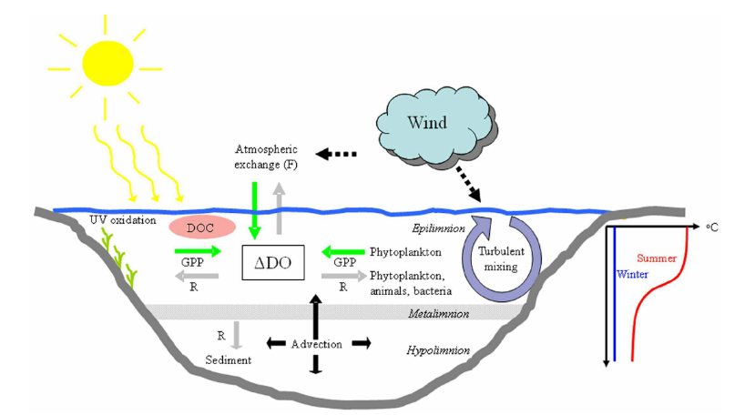

```{r setup, include=FALSE}
knitr::opts_chunk$set(echo = TRUE)
```

## Introducción

En el medio acuático tienen lugar todos los procesos metabólicos a través de los cuales la vida ha encontrado la manera de perpetuar su existencia modificando las sustancias que le rodean. La diversidad de las rutas a través de las cuales los organismos son capaces de obtener energía para realizar todos los procesos vitales es inabarcable en una práctica y, además, no es el objetivo final de esta. Sin embargo, las dos principales rutas que dominan el mundo aeróbico, debido a su gran eficiencia frente a las demás, son la fotosíntesis oxigénica y la respiración aeróbica ^[A partir de ahora, siempre que nos refiramos a la fotosíntesis o a la respiración a secas nos estamos refieriendo a la fotosíntesis oxigénica y la respiración aeróbica.], el resto de rutas encuentra su máxima relevancia en aquellos nichos en los que se dan las condiciones adecuadas y no son posible otros mecanismos más eficientes de obtención de energía. Por lo tanto, en un sistema acuático bien oxigenado los dos principales procesos que tienen un mayor impacto en el ecosistema son la fotosíntesis y la respiración. Del balance entre ambos procesos puede depender la cálidad del agua, tornándose anóxica, si prima la respiración por encima de los procesos de producción primaria, y comprometiendo muchas formas de vida. Además, ambos procesos juegan un papel relevante en el ciclo del carbono, retirando CO~2~ del entorno mediante la fotosíntesis (PP) o liberando CO~2~ a través de la respiración.

Al igual que a nivel de organismo o de individuo, el metabolismo puede ser interpretado a nivel de ecosistema como el conjunto de procesos metabolicos que tienen lugar en dicho ecosistema. Como hemos dicho anteriormente, en un sistema acuático bien oxigenado, fotosíntesis y respiración son los procesos más importantes que determinan el metabolismo del ecosistema y su papel en los ciclos biogeoquímicos globales.

Si queremos estimar el metabolismo aeróbico de un lago, los cambios en la concentración de oxígeno disuelto (OD) es una de las variables más utilizadas. Esta puede ser medida en botellas de incubación y monitorizar el cambio en la concentración de O~2~ durante un periodo de tiempo determinado y en un volumen de agua concreto. Esto ofrece la ventaja de controlar las condiciones ambientales (temperatura, irradiancia, etc) y poder realizar replicas. Sin embargo, el "efecto contenedor" conlleva ciertas limitaciones a la hora de escalar a nivel de ecosistema. Otra manera puede ser medir los cambios en la concentración de oxígeno directamente en la masa de agua ("aguas libres"), de este modo el escalado a nivel del conjunto de la masa es más realista, no sin ciertas límitaciones e incertidumbres [@Staehr2007,@Mccutchan1998,@Hanson2008,@Staehr2010]. Sabemos que la respiración y la producción primaria afectan directamente a la concentración de OD, consumiendo oxígeno en el primer caso y produciendolo en el segundo. Sin embargo, hay otros factores físicos que pueden afectar a la concentración de OD (Ver figura). Por lo tanto, podríamos definir el cambio en la concentración de oxígeno con la siguiente ecuación:

$$\frac{\Delta OD}{\Delta t} = GPP - R - At_{ex} - E$$

Donde, GPP es la producción primaria bruta, R es la respiración, At~ex~ es el intercambio gaseoso con la atmósfera y E serían otros factores, de menor magnitud, que afectan a la concentración de OD como, por ejemplo, la oxidación fotoquímica de la materia orgánica o advección.

Por lo tanto, si medimos los cambios que se producen en la concentración de OD durante un día completo en un lago, y podemos calcular el intercambio gaseoso de O~2~ que se produce entre la masa de agua y la atmósfera, podremos estimar su metabolismo. Por la noche, el cambio en la concentración de OD, no producto del intercambio gaseoso, será debido a la respiración. Durante el día, sin embargo, este cambio será debido a la producción neta (NEP). Conociendo que $NEP = GPP - R$ y habiendo calculado la respiración, podemos averiguar cual es la producción primaria bruta del sistema. 

Este modelo tiene ciertas asunciones que conviene tener presente:

  1. Los cambios en la concentración de OD son el resultado del balance entre producción fotosintética y respiración así como del intercambio con la atmósfera. Es decir, asume que E es despreciable.
  2. La producción primaria tiene lugar solo durante el día.
  3. La tasa de respiración durante la noche es la misma que durante el día.



## Estructura de la práctica

  1. Obtener los datos con los que vamos a trabajar. Usaremos la red [The Global Lake Ecological Observatory Network (GLEON)](https://gleon.org/). Esta red pone a nuestra disposición una amplia cantidad de datos de monitoreo de alta frecuencia (HFM) de distintos lugares del mundo.
  2. Familiarizarnos con los paquetes y funciones básicos de R que nos facilitan explorar y trabajar con grandes tablas de datos.
  3. Estimar el metabolismo de un lago usando el paquete de R [LakeMetabolizer](https://cran.r-project.org/web/packages/LakeMetabolizer/LakeMetabolizer.pdf).
  4. Explorar y representar los resultados obtenidos.

## Descargar los datos de la red GLEON

Para ello, visitamos la página de la red [GLEON](https://gleon.org/) y nos vamos al apartado de [datos](https://gleon.org/data). En esta sección podemos encontrar la [política de datos de GLEON](https://gleon.org/sites/default/files/pdf/data/2009_October_15_GLEON_data_access_policy.pdf), basicamente se apuesta por una ciencia colaborativa en la que los datos quedan a disposición de la comunidad para cualquier fin de investigación, académico, educativo o cualquier otro, siempre que no haya un interés lucrativo detrás y respetando algunos principios de comunicación con los responsables de los datos. Como se muestra en esta sección, a los datos de GLEON se puede acceder a través de tres buscadores [EDI](https://portal.edirepository.org/nis/home.jsp), [DataONE](https://search.dataone.org/data) o [Google data set](https://datasetsearch.research.google.com/).

Pues bien, para este práctica vamos a trabajar, en concreto, con datos del [lago Trout](https://lter.limnology.wisc.edu/researchsite/trout-lake). 
Así que utilizando el buscador que más sea de vuestro agrado lanzamos la siguiente busqueda: *ecosystem metabolism lake trout*.
Entre los resultados obtenidos (hay bastante información como podéis observar), vamos a seleccionar los datos derivados del proyecto [North Temperate Lakes Long Term Ecologycal Research (NTL-LTER)](https://lter.limnology.wisc.edu/index.php/) que nos ofrecen datos meteorológicos y de oxígeno disuelto desde 2004 hasta la actualidad. Si no pudierais encontrarlos, podéis pinchar [aquí: North Temperate Lakes LTER: High Frequency Meteorological and Dissolved Oxygen Data - Trout Lake Buoy 2004 - current](https://portal.edirepository.org/nis/mapbrowse?packageid=knb-lter-ntl.117.38). 

En esa página que acabais de abrir tenéis un sumario con toda la información necesaria sobre el paquete de datos (*Title, Creators, Publication Date, Citation, Abstract, Spatial Coverage, Package ID, Resources, Intellectual Rights, Digital Object Identifier, PASTA Identifier, Code Generation, Provenance, Journal Citations*). Las que más nos van a interesar por el momento son *Abstract, Resources y Code Generation*. La primera de ellas es un resumen que nos explica como han sido recogido los datos y algunas particularidades que debemos saber, en la segunda tenemos directamente los archivos con los datos para descargarlos en formato \*.csv y una opción muy interesante, [*View Full Metadata*](https://portal.edirepository.org/nis/metadataviewer?packageid=knb-lter-ntl.117.38), en la que si desplegamos *Data Entities* podemos ver información sobre las variables que aparecen en la tabla de datos como, por ejemplo, las unidades en las que están medidas.

Disponemos de dos resoluciones temporales de datos, una diaria y otra horaria. Si queremos estimar el metabolismo no nos sirven los datos diarios. Para descargar los datos tenemos dos opciones:

  1. Podemos pinchar directamente en el archivo y descargarlo a través del navegador. Name: North Temperate Lakes LTER - Hourly Meteorological and Dissolved Oxygen Data - Trout Lake File: **ntl117_2_v4.csv**  (4.4M; 13 downloads). Si optamos por esta opción, posteriormente habrá que importar los datos a R.
  2. Otra opción mucho más cómoda es la de usar un script de R que ya nos han preparado para facilitarnos la descarga e importación. Para ello, pinchamos en el [icono de R el apartado *Code Generation*](https://portal.edirepository.org/nis/codeGeneration?packageId=knb-lter-ntl.117.38&statisticalFileType=r). Como véis también hay opción para descargar y trabajar directamente los datos con otras herramientas, si a alguno le pica la curiosidad ¡adelante!. En esta práctica como hemos dicho vamos a usar R, debido a que es una herramienta gratuita, de código abierto y libre. Además es ampliamente usado en investigación debido a su naturaleza libre y colaborativa. En fin, si más dilaciones, podéis decargar el script pinchando en *File Download: knb-lter-ntl.117.38.r*  y abrirlo con RStudio y ejecutarlo (solo el trozo que nos interesa).
  
Esta es la pinta que tiene el script:
```{r eval = FALSE}
# Package ID: knb-lter-ntl.117.38 Cataloging System:https://pasta.edirepository.org.
# Data set title: North Temperate Lakes LTER: High Frequency Meteorological and Dissolved Oxygen Data - Trout Lake Buoy 2004 - current.
# Data set creator:  NTL Lead PI - University of Wisconsin 
# Data set creator:  John Magnuson - University of Wisconsin 
# Data set creator:  Stephen Carpenter - University of Wisconsin 
# Data set creator:  Emily Stanley - University of Wisconsin 
# Metadata Provider:  NTL Information Manager - University of Wisconsin 
# Contact:  NTL Information Manager -  University of Wisconsin  - ntl.infomgr@gmail.com
# Contact:  NTL Lead PI -  University of Wisconsin  - ntl.leadpi@gmail.com
# Stylesheet v2.7 for metadata conversion into program: John H. Porter, Univ. Virginia, jporter@virginia.edu 

inUrl1  <- "https://pasta.lternet.edu/package/data/eml/knb-lter-ntl/117/38/e7cef73c65218cbf1acd1ff460969029" 
infile1 <- tempfile()
download.file(inUrl1,infile1,method="curl")

                   
 dt1 <-read.csv(infile1,header=F 
          ,skip=1
            ,sep=","  
                ,quot='"' 
        , col.names=c(
                    "sampledate",     
                    "year4",     
                    "month",     
                    "daynum",     
                    "avg_air_temp",     
                    "flag_avg_air_temp",     
                    "avg_rel_hum",     
                    "flag_avg_rel_hum",     
                    "avg_wind_speed",     
                    "flag_avg_wind_speed",     
                    "avg_wind_dir",     
                    "flag_avg_wind_dir",     
                    "avg_do_raw",     
                    "flag_avg_do_raw",     
                    "avg_do_sat",     
                    "flag_avg_do_sat",     
                    "avg_do_wtemp",     
                    "flag_avg_do_wtemp",     
                    "avg_barom_pres_mbar",     
                    "flag_avg_barom_pres_mbar",     
                    "avg_par",     
                    "flag_avg_par"    ), check.names=TRUE)
```

Esta primera parte del script es para descargar los datos diarios, los cuales dijimos que no nos interesaban, por lo tanto vamos más abajo en el script (entre las líneas 110-207) para descargar los datos por hora. Este es aspecto que tiene (salvo que me he tomado el tiempo de comentar algunas líneas):

```{r}
inUrl2  <- "https://pasta.lternet.edu/package/data/eml/knb-lter-ntl/117/38/7f36b24e62c5798b16517e9dd85fd628" #Esta es la dirección de donde descarga los datos
infile2 <- tempfile() #Crea un objeto temporal donde  posteriormente guardar los datos
download.file(inUrl2,infile2,method="curl") #Decarga los datos al objeto temporal (A vosotros os debe aparecer method = "auto", aquí esta modificado el método para poder descargarlo dentro del documento.)

                   
 dt2 <-read.csv(infile2,header=F #Crea un objeto donde "vuelca los datos descargados"
          ,skip=1
            ,sep=","  
                ,quot='"' 
        , col.names=c(
                    "sampledate",     #Asigna nombre a las columnas
                    "year4",     
                    "month",     
                    "daynum",     
                    "hour",     
                    "avg_air_temp",     
                    "flag_avg_air_temp",     
                    "avg_rel_hum",     
                    "flag_avg_rel_hum",     
                    "avg_wind_speed",     
                    "flag_avg_wind_speed",     
                    "avg_wind_dir",     
                    "flag_avg_wind_dir",     
                    "avg_do_raw",     
                    "flag_avg_do_raw",     
                    "avg_do_sat",     
                    "flag_avg_do_sat",     
                    "avg_do_wtemp",     
                    "flag_avg_do_wtemp",     
                    "avg_barom_pres_mbar",     
                    "flag_avg_barom_pres_mbar",     
                    "avg_par",     
                    "flag_avg_par"    ), check.names=TRUE)
               
```

Este trocito de código que sigue es para corregir algún problema de formato que se haya podido introducir debido a algún error en la base de datos.

```{r}
# Fix any interval or ratio columns mistakenly read in as nominal and nominal columns read as numeric or dates read as strings
                                                   
# attempting to convert dt2$sampledate dateTime string to R date structure (date or POSIXct)                                
tmpDateFormat<-"%Y-%m-%d"
tmp2sampledate<-as.Date(dt2$sampledate,format=tmpDateFormat)
# Keep the new dates only if they all converted correctly
if(length(tmp2sampledate) == length(tmp2sampledate[!is.na(tmp2sampledate)])){dt2$sampledate <- tmp2sampledate } else {print("Date conversion failed for dt2$sampledate. Please inspect the data and do the date conversion yourself.")}                                                                    
rm(tmpDateFormat,tmp2sampledate) 
if (class(dt2$year4)=="factor") dt2$year4 <-as.numeric(levels(dt2$year4))[as.integer(dt2$year4) ]
if (class(dt2$month)=="factor") dt2$month <-as.numeric(levels(dt2$month))[as.integer(dt2$month) ]
if (class(dt2$daynum)=="factor") dt2$daynum <-as.numeric(levels(dt2$daynum))[as.integer(dt2$daynum) ]
if (class(dt2$avg_air_temp)=="factor") dt2$avg_air_temp <-as.numeric(levels(dt2$avg_air_temp))[as.integer(dt2$avg_air_temp) ]
if (class(dt2$flag_avg_air_temp)!="factor") dt2$flag_avg_air_temp<- as.factor(dt2$flag_avg_air_temp)
if (class(dt2$avg_rel_hum)=="factor") dt2$avg_rel_hum <-as.numeric(levels(dt2$avg_rel_hum))[as.integer(dt2$avg_rel_hum) ]
if (class(dt2$flag_avg_rel_hum)!="factor") dt2$flag_avg_rel_hum<- as.factor(dt2$flag_avg_rel_hum)
if (class(dt2$avg_wind_speed)=="factor") dt2$avg_wind_speed <-as.numeric(levels(dt2$avg_wind_speed))[as.integer(dt2$avg_wind_speed) ]
if (class(dt2$flag_avg_wind_speed)!="factor") dt2$flag_avg_wind_speed<- as.factor(dt2$flag_avg_wind_speed)
if (class(dt2$avg_wind_dir)=="factor") dt2$avg_wind_dir <-as.numeric(levels(dt2$avg_wind_dir))[as.integer(dt2$avg_wind_dir) ]
if (class(dt2$flag_avg_wind_dir)!="factor") dt2$flag_avg_wind_dir<- as.factor(dt2$flag_avg_wind_dir)
if (class(dt2$avg_do_raw)=="factor") dt2$avg_do_raw <-as.numeric(levels(dt2$avg_do_raw))[as.integer(dt2$avg_do_raw) ]
if (class(dt2$flag_avg_do_raw)!="factor") dt2$flag_avg_do_raw<- as.factor(dt2$flag_avg_do_raw)
if (class(dt2$avg_do_sat)=="factor") dt2$avg_do_sat <-as.numeric(levels(dt2$avg_do_sat))[as.integer(dt2$avg_do_sat) ]
if (class(dt2$flag_avg_do_sat)!="factor") dt2$flag_avg_do_sat<- as.factor(dt2$flag_avg_do_sat)
if (class(dt2$avg_do_wtemp)=="factor") dt2$avg_do_wtemp <-as.numeric(levels(dt2$avg_do_wtemp))[as.integer(dt2$avg_do_wtemp) ]
if (class(dt2$flag_avg_do_wtemp)!="factor") dt2$flag_avg_do_wtemp<- as.factor(dt2$flag_avg_do_wtemp)
if (class(dt2$avg_barom_pres_mbar)=="factor") dt2$avg_barom_pres_mbar <-as.numeric(levels(dt2$avg_barom_pres_mbar))[as.integer(dt2$avg_barom_pres_mbar) ]
if (class(dt2$flag_avg_barom_pres_mbar)!="factor") dt2$flag_avg_barom_pres_mbar<- as.factor(dt2$flag_avg_barom_pres_mbar)
if (class(dt2$avg_par)=="factor") dt2$avg_par <-as.numeric(levels(dt2$avg_par))[as.integer(dt2$avg_par) ]
if (class(dt2$flag_avg_par)!="factor") dt2$flag_avg_par<- as.factor(dt2$flag_avg_par)
                
# Convert Missing Values to NA for non-dates
```                

Este último trozo es simplemente para ver la estructura de los datos y un resumen de cada una de la variables. Este trozo no es necesario que lo ejecutéis.

```{r}
# Here is the structure of the input data frame:
str(dt2)                            
attach(dt2)                            
# The analyses below are basic descriptions of the variables. After testing, they should be replaced.                 

summary(sampledate)
summary(year4)
summary(month)
summary(daynum)
summary(hour)
summary(avg_air_temp)
summary(flag_avg_air_temp)
summary(avg_rel_hum)
summary(flag_avg_rel_hum)
summary(avg_wind_speed)
summary(flag_avg_wind_speed)
summary(avg_wind_dir)
summary(flag_avg_wind_dir)
summary(avg_do_raw)
summary(flag_avg_do_raw)
summary(avg_do_sat)
summary(flag_avg_do_sat)
summary(avg_do_wtemp)
summary(flag_avg_do_wtemp)
summary(avg_barom_pres_mbar)
summary(flag_avg_barom_pres_mbar)
summary(avg_par)
summary(flag_avg_par) 
detach(dt2)               
```

Bien, una vez ejecutado el script, ya debemos tener los datos en nuestro entorno de RStudio en un tipo de objeto denominado data.frame (básicamente una tabla de datos). Vamos a ver que pinta tienen:

```{r}
head(dt2)
```

Por último, los vamos a guardar en la carpeta "Datos_descargados" que hemos creado..

```{r}
write.csv(dt2, "./Datos_descargados/Datos_Trout.csv", row.names = FALSE)
```

<div class="ejercicios">
<h2 class="texto">Tarea</h2>
<p class="texto">En los datos que acabamos de descargar, la información de cada variable (oxígeno disuelto, temperatura, etc) solo aparece para una profundidad.</p>
<p class="textoC">Busca información de temperatura del agua medida a distintas profundidades en el Lago Trout. El periodo de tiempo debe ser desde 2004 hasta la actualidad (el mismo periodo que ya tenemos).</p>
<p class="texto">Pega el enlace en un archivo un súbelo al campus virtual antes de las 13:59 h del lunes 13 de junio.</p></div>

## Bibliografía