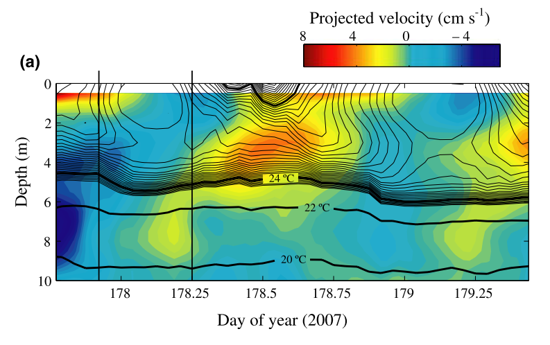

```{r setup, include=FALSE}
knitr::opts_chunk$set(echo = TRUE)
```

## Representación gráfica

Después de algunas peleas con los datos y, porqué no ser sinceros, con el maldito-bendito R, ya tenemos suficiente información sobre el lago Trout. El siguiente paso es representar gráficamente esta información para poder interpretar mejor los resultados y comunicarlos de forma efectiva al resto de compañerxs. El paquete estrella de R para esta tarea, ya lo conocéis, es `ggplot2`.

Antes de empezar vamos a cargar todos los datos que necesitaremos.

```{r}
#Datos iniciales
  datos.ts <-  read.csv("./Datos/datos_ts_2005_zmix.csv")
  datos.ts$datetime <- as.POSIXct(datos.ts$datetime)
#Datos temperatura
  Perfiles_temp <- read.csv("./Datos/Perfiles_temp.csv")
  Perfiles_temp$sampledate <- as.Date(Perfiles_temp$sampledate)
  Perfiles_temp$datetime<- as.POSIXct(Perfiles_temp$datetime)
#Datos metabolismo
  datos_metab <- read.csv("./Datos/Metabolismo_Trout.csv")
```

### Variables físico-químicas

Lo primero que vamos a hacer es generar algunas sencillas gráficas para ver el estado del lago durante el periodo que hemos seleccionado.

```{r}
library(ggplot2)
 ggplot(datos.ts, aes(x=datetime, y=do.obs))+
   geom_point()
```

Podemos repetir esta gráfica para cada una de las variables que tenemos o podemos servirnos del paquete `reshape2` y convertir la tabla de datos a forma "largo" y usar una capa para que haga una gráfica por cada variable.

```{r}
library(reshape2)
#Convertimos la tabla a formato largo
datos.ts_l <- melt(datos.ts, id.vars = c("datetime") , varnames = c('variable'), value.name = 'valor')
 
#Representamos
  ggplot(datos.ts_l, aes(x = datetime, y = valor))+
    geom_point()+
    facet_wrap(~variable, scales = "free_y", ncol = 2)
```

También podríamos, por ejemplo, querer hacer un "zoom" a solo unos días para ver si existen tendencencias diarias.

```{r}
library(lubridate)
    ggplot(subset(datos.ts_l, date(datetime) >= "2005-09-05" & date(datetime) <= "2005-09-07"), aes(x = datetime, y = valor))+
    geom_point()+
    facet_wrap(~variable, scales = "free_y", ncol = 2)+
    scale_x_datetime(date_labels = "%R")
```

Vamos a modificar un poco el aspecto de las gráficas anteriores antes de pasar las siguientes:

```{r}
#Podemos usar un "theme" prediseñado
  Grafica_vars <- ggplot(datos.ts_l, aes(x = datetime, y = valor))+
    geom_point()+
    facet_wrap(~variable, scales = "free_y", ncol = 2)
    
  Grafica_vars + theme_classic(base_size = 12, base_family = "Times")
  Grafica_vars + labs(x = NULL, y = NULL)

#Y luego cambiar algunos aspecto del "theme" de la gráfica usando:  %+replace% theme(axis.title = element_blank(), strip.background = element_blank())

    Grafica_vars + theme_classic(base_size = 12, base_family = "Times")%+replace% theme(axis.title = element_blank(), strip.background = element_blank())
    
#También podemos modificar el "theme" directamente a nuestro gusto
Grafica_vars + theme(axis.title = element_blank(), panel.grid = element_blank(), plot.background = element_rect(fill = "black"))
```

Una vez que tenemos el aspecto que deseamos de nuestra gráfica, la guardamos y la exportamos, a la carpeta que creamos llamada "Graficas", para poder usarla en cualquier documento en el que estemos trabajando.

```{r}
#Guardamos
Grafica_vars_exp <- Grafica_vars + theme_classic(base_size = 12, base_family = "Times") + labs(x = NULL, y = NULL)
#Exportamos
ggsave("./Graficas/Grafica_variables.png", Grafica_vars_exp, width = 15, height = 20, units = "cm")
  
```

### Estructura térmica del lago.

Como finalmente conseguimos encontrar datos de la temperatura del lago a distintas profundidades sería interesante realizar una gráfica de contorno del periodo estudiado. Estas gráficas son muy visuales y ayudan a entender mejor el comportamiento del lago. Las vemos a menudo en los artículos.



Existen distintos programas que permiten hacer estas gráficas como son Surfer, SigmaPlot o OceanDataView, con el inconveniente que la mayoría de ellos son privativos y de pago (OceanDataView se salva!). Además, ya que estamos metidos en harina porque no hacerlo todo con el mismo programa. R nos permite trabajar desde los datos crudos hasta la generación de gráficas e informes (estos documentos están hechos directamente desde R).

Vamos a partir de la tabla de datos en formato "ancho" que creamos para calcular la profundidad de la capa de mezcla.

```{r}
library(reshape2)
#Así creamos el archivo
dt_wtemp <- dcast(Perfiles_temp, datetime ~ depth, value.var = "wtemp")
#Renombramos las columnas según nos pide la función
colnames(dt_wtemp)[-1] <- paste("wtr", colnames(dt_wtemp)[-1], sep = '_')
```

Al transformar el objeto a formato "ancho" hemos homogeneizado las profundidades a las que tenemos datos de temperatura. Es decir, tenemos el mismo número de medidas y a las mismas profundidades para cada momento. Sin embargo, como los datos no estaban completos se han introducidos NAs en aquellas profundidades donde no teníamos información. Por ejemplo, en el perfil de las 1:00 am del 205-09-01, tenemos datos de temperatura a 11.5 y a 12.5 metros pero no a 12 m. Para solucionar esto, podemos interpolar los datos.

```{r}
library(zoo)
#Interpolamos
  dt_wtemp[,-1] <- na.approx(dt_wtemp[,-1],rule = 2)
```

Ahora podemos devolver los datos a su formato largo.

```{r}
library(readr)
  Per_melt <- melt(dt_wtemp, id.vars = c("datetime"))
  Per_melt$variable <- parse_number(as.character(Per_melt$variable))
  colnames(Per_melt) <- c("datetime", "depth", "wtemp")
```

E intentamos representar.

```{r}
ggplot(Per_melt, aes(x = datetime, y = depth, color = wtemp))+
  geom_point()
```

Parece que estamos bastante cerca, sin embargo, hay muchos huecos en blanco. Para solucionar esto vamos a crear una matriz y a usar una interpolación espacial multinivel b-spline para completar la información que nos falta.

```{r}
library(lubridate)
  #Primero tenemos que convertir las fechas en un vector numérico
  Per_melt$datetime <- decimal_date(Per_melt$datetime)
library(MBA)
# Aquí creamos una matriz con mayor resolución usando una interpolación espacial multinivel b-spline
Temp_mba <- mba.surf(Per_melt, no.X = 500, no.Y = 500, extend = T)
#Aquí están las fecha con la nueva resolución (en este caso es menor de la que teniamos, 500 "perfiles", frente a los 1464 que teníamos, pero no necesitamos más)
head(Temp_mba$xyz.est$x)
#Aquí tenemos las nuevas profundidades, 500 profundidades en lugar de las 27 que teniamos antes
head(Temp_mba$xyz.est$y)
#Estos son los datos de temperatura
head(Temp_mba$xyz.est$z)[1:10]
#Los juntamos todos
dimnames(Temp_mba$xyz.est$z) <- list(Temp_mba$xyz.est$x, Temp_mba$xyz.est$y)
#Y los volvemos al formato largo.
library(dplyr)
Temp_mba <- melt(Temp_mba$xyz.est$z, varnames = c('date', 'depth'), value.name = 'temp') %>%  mutate(temp = round(temp, 3))
  
#Esta es la pinta de los datos:
head(Temp_mba)
```

Ahora representamos de nuevo.

```{r}
ggplot(Temp_mba, aes(x = date, y = depth, color = temp))+
  geom_point()
```

¡Mucho mejor! Vamos a cambiar algunos aspectos estéticos para que quede más resultona.

```{r}
#Vamos a devolverle el formato de fecha
Temp_mba$date <- date_decimal(Temp_mba$date)
#Cargamos un paquete para usar una paleta de color má común
library(colorRamps)
Grafica_temp <- ggplot(data = Temp_mba, aes(x = date, y = depth)) +
  geom_tile(aes(fill = temp)) + #Usamos esta capa que viene mejor para este tipo de gráficos pero podíamos haber usado geom_point
  scale_y_reverse()+
  scale_fill_gradientn(colours = matlab.like2(10)) +
  geom_contour(aes(z = temp), binwidth = 2, colour = "black", alpha = 0.2) +
  labs(y = "Profundidad (m)", x = NULL, fill = "temp. (°C)") +
  coord_cartesian(expand = 0)
Grafica_temp
```

Hemos cambiado el formato de la fecha, hemos invertido el eje profundidad para que se más intuitivo, hemos cambiado las etiquetas, el color y añadido unas lineas de contorno.

Vamos a probar a añadirle la profundidad de la capa de mezcla.

```{r}
  Grafica_temp_zmix <- Grafica_temp + geom_line(data = datos.ts, aes(x=datetime, y = z.mix, color = "Capa mezcla"), size = 0.2)+
  scale_color_manual(values = "black") + labs(color = NULL)
  
  Grafica_temp_zmix
```

Y ya la tenemos lista para exportar.

```{r}
ggsave("./Graficas/Grafica_temp.png", Grafica_temp_zmix, width = 20, height = 10, units = "cm")
```

## Resultados del metabolismo

Por último, vamos a representar los resultados que hemos obtenido del metabolismo del lago Trout. Como hemos hecho anteriormente convertimos los datos a formato "largo" y representamos.

```{r}
#transformamos
datos_metab_long <- melt(datos_metab, id.vars = c("year", "doy"))
#Vamos a crear una variable fecha que convierta el día del año (doy) en dia mes y año
datos_metab_long$date <- as.Date(datos_metab_long$doy, origin = "2004-12-31")

#representamos 
Grafica_metab <- ggplot(datos_metab_long, aes(x = date, y = value, color = variable))+
   geom_point()
Grafica_metab
 #vamos a modificar un poco los aspectos estéticos
 Grafica_metab <- Grafica_metab + scale_color_manual(values = c("Green", "Brown", "Darkgreen"))+
   labs(x= NULL, y = expression(paste("mg O"[2], "·L"^{-1},"día"^{-1}, sep = "")), color = NULL )+
   theme_classic(base_size = 12, base_family = "Times")

 Grafica_metab
 #La exportamos
 ggsave("./Graficas/Metabolismo_Trout_sept-oct.png", Grafica_metab, width = 15, height = 10, units = "cm")
```

Si queremos obtener una visión global del metabolismo durante todo el periodo estudiado podemos probar con un tipo de gráfica de cajas y bigotes.

```{r}
  Grafica_metab_boxplot <- ggplot(datos_metab_long, aes(x = variable, y = value))+
  geom_boxplot()

Grafica_metab_boxplot

#Vamos a mejorarla un poco estéticamente.  

Grafica_metab_boxplot <- ggplot(datos_metab_long, aes(x = variable, y = value, fill = variable))+
  geom_boxplot()+
  scale_fill_manual(values = c("Green", "Brown", "Darkgreen"))+
   labs(x= NULL, y = expression(paste("mg O"[2], "·L"^{-1},"día"^{-1}, sep = "")), fill = NULL )+
   theme_classic(base_size = 12, base_family = "Times")
  Grafica_metab_boxplot

  
```

Esta es un representación más transparente de nuestros datos, en la que podemos ver la mediana (la linea), los cuartiles 1 y 4 (los límites de la caja) y los valores que se salen del rango. Sin embargo, sé que nos han acostumbrado a representar la media y la desviación estándar. Como os puede ser de utilidad en el futuro (no tan lejano, para el TFM por ejemplo) vamos a ver como hacerlo.

```{r}
#Primero debemos calcular la media y la desviación estándar
library(plyr)
  Metab_mSd <- ddply(datos_metab_long, ~variable, summarize, Media = mean(value), Sd = sd(value))
#Aquí lo tenemos
  Metab_mSd
#Y luego lo representamos
  ggplot(Metab_mSd, aes(x = variable, y = Media))+
    geom_point()+
    geom_errorbar(aes(ymin = Media-Sd, ymax = Media+Sd))
  #Vamos a cambiar algunos aspectos estéticos
  Grafica_metab_mSd <- ggplot(Metab_mSd, aes(x = variable, y = Media))+
    geom_point(size = 4)+
    geom_errorbar(aes(ymin = Media-Sd, ymax = Media+Sd), width = 0.2)+
   labs(x= NULL, y = expression(paste("mg O"[2], "·L"^{-1},"día"^{-1}, sep = "")))+
    theme_classic(base_size = 12, base_family = "Times")
  Grafica_metab_mSd
  #Y exportamos
  ggsave("./Graficas/Grafica_metab_mSd.png", Grafica_metab_mSd, width = 10, height = 10, units = "cm")
```

Una vez ya tenéis los datos más importantes organizados y representados y las estimas del metabolismo calculadas tocaría, con los conocimientos teóricos de los que disponéis, interpretar esta información.

## Recopilamos

Una vez llegados a este punto hemos:

  1. Conocido una red de trabajo internacional colaborativa que nos ofrece datos de gran interés sobre sistemas acuáticos, así como buscadores para acceder a este tipo de información. 
  2. Descargado esta información y trabajado con gran cantidad de datos, que con las hojas de cálculo tradicionales (Calc o Excel) hubiera sido, siendo politicamente correctos, bastante tedioso.
  3. Conocido algunas de la funciones que nos ofrece el paquete `LakeMetabolizer` para calcular o estimar distintas variables de gran utilidad e interés en limnología.
  4. Representado la información obtenida con la calidad necesaria para su publicación en revistas científicas.
  
<div class="ejercicios">
<h2 class="texto">Tarea</h2>
<p class="texto">Ya disponemos de toda la información, así que, esta será la última tarea para completar las prácticas de la asignatura.</p>
<p class="textoC">
Tienes dos opciones (elige una):

  1. Presenta las gráficas que hemos obtenido en la práctica para describir el Lago Trout (periodo 01-09-2005\/31-10-2005) y comenta, con tus conocimientos teóricos, los resultados obtenidos. 
  
  2. Si te ha interesado la práctica y quieres probar-mejorar tu manejo con R, presenta y comenta las gráficas, que tú creas necesarias para describir el Lago Trout y su metabolismo, para un periodo distinto al que hemos usado para la práctica. El periodo debe ser de, al menos, dos semanas.</p>
<p class="texto">En ambos casos sube un documento .pdf al campus virtual y el código de R que has usado.</p></div>

## Bibliografía